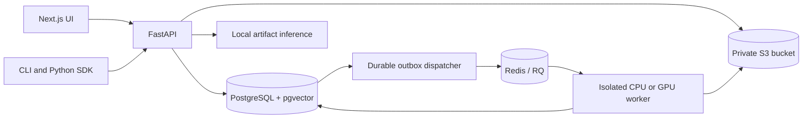

# Architecture

The Next.js app is an authenticated browser client. Its same-origin backend-for-frontend keeps the API key in an HttpOnly, SameSite=Strict cookie, validates mutation origins and proxies requests to FastAPI. UI, CLI and Python SDK share the same API. No training logic lives in the web layer.

The deployment owner operates all data-plane services. Foundation weights can be downloaded from Hugging Face with remote code disabled; no uploaded text is used in those requests. A saved base encoder is packaged with each embedding artifact, allowing an offline comparison against the exact starting model.

## Persistent objects

- `Language`: workspace ID, metadata, PRIVATE visibility. Every resource lookup checks its language's workspace.
- `Source`: original bytes at a unique object key, SHA-256, source/community permissions, mapping and normalization configuration. Re-import is allowed only before source approval.
- `Entry`: original row, canonical fields, transformation proposals, issue codes, approval and eligibility. Original spellings remain intact even when normalized fields change.
- `Dataset`: immutable JSON snapshot, version, source IDs/permissions, content hash, generator version and seed, connected groups and entry-level assignments.
- `TrainingRun`: immutable task/model/revision/hyperparameters/seed/code/environment; mutable lifecycle fields only. Configuration changes require a new run.
- `RunEvent`: append-only progress and metric observations, streamed using SSE with an event cursor.
- `ModelRecord`: artifact hash and location, metrics, run/dataset identity, version and explicit lifecycle. Evaluation precedes registration; trained/evaluated transitions are recorded by the run. Owner approval precedes deployment.
- `Deployment`: one active model per language and task. A transaction builds verified vectors and switches the pointer; failure leaves the previous model active.
- `ConceptVector`: model/language/entry/kind partition plus private concept payload. Exact pgvector cosine ordering avoids an approximate-retrieval tradeoff on small dictionaries.
- `AuditEvent`: append-only approval, key and deployment decisions, without dictionary contents.

Versioned migrations freeze schema DDL. Database triggers enforce dataset, model-provenance and run-configuration immutability, including direct SQL changes. The append-only log tables cannot be altered via normal SQL. PostgreSQL superusers remain within the deployment owner's administrative trust boundary.

## Worker delivery and recovery

Creating a run commits QUEUED to PostgreSQL. A dispatcher schedules outstanding IDs into RQ, even after a temporary Redis outage. Redis AOF and `noeviction` protect queue state. Workers atomically claim QUEUED → PREPARING so duplicate delivery does not retrain or register duplicate models. RQ spawns a separate process for each job, avoiding unsafe PyTorch forks on macOS.

Workers heartbeat independently of batch logging. A run without a heartbeat for five minutes is marked FAILED; completed RQ job records are not treated as completed model training. A new run is required to retry a terminal run. Cancellation is cooperative at logged batch/evaluation boundaries and is rechecked before registration. Downloads and a single long forward pass are not interruptible through the cooperative flag; RQ timeout provides a separate hard bound.

Artifact storage is outside the DB transaction; failed final registration can leave an unreferenced private object. A future retention job can remove these after checking all references. No automatic destructive cleanup is included.

## Model boundary

`ml/interfaces.py` defines BaseModel, TextEncoder, GenerativeModel, Classifier, Trainer, Evaluator and a modality-neutral Representation contract. SentenceTransformer is one encoder implementation. Canonical data/splits and evaluation do not import web UI modules. Worker orchestration adapts persistent records into these interfaces.

Future corpora should introduce new explicit source types and generators; they should preserve provenance and their own leakage units (e.g. speaker/document/session). Speech/image encoders can implement representation adapters without changing dictionary ownership. Shared-space or mixed-language training must be a future explicit policy and task, never an accidental consequence of a broad query.
